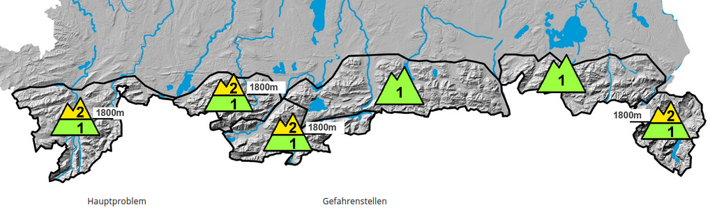
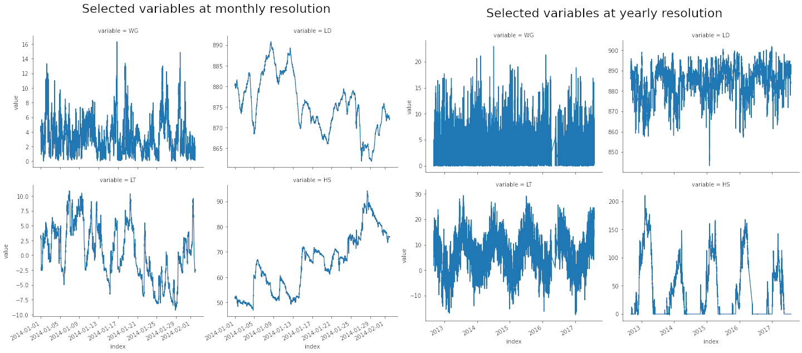
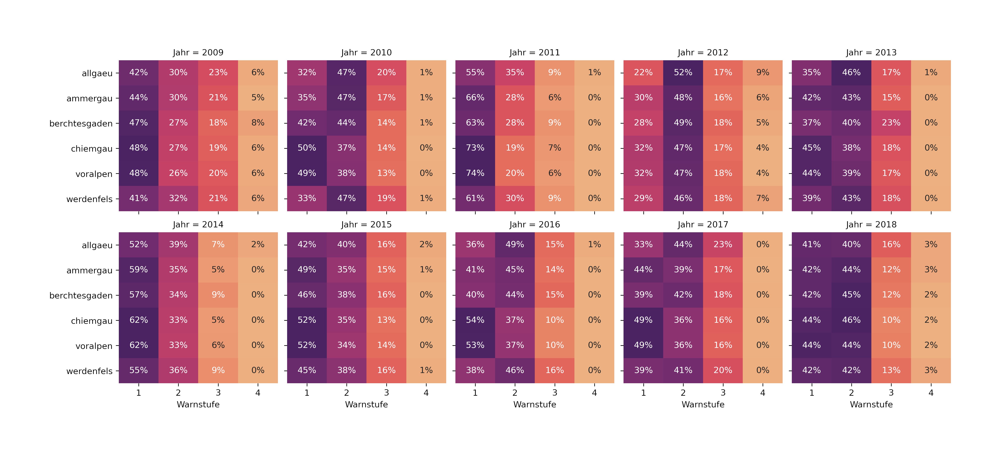
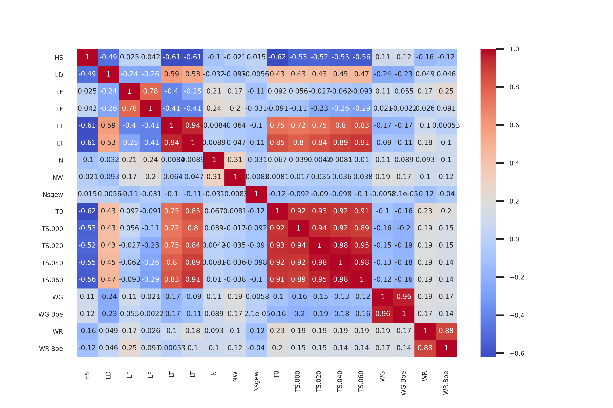
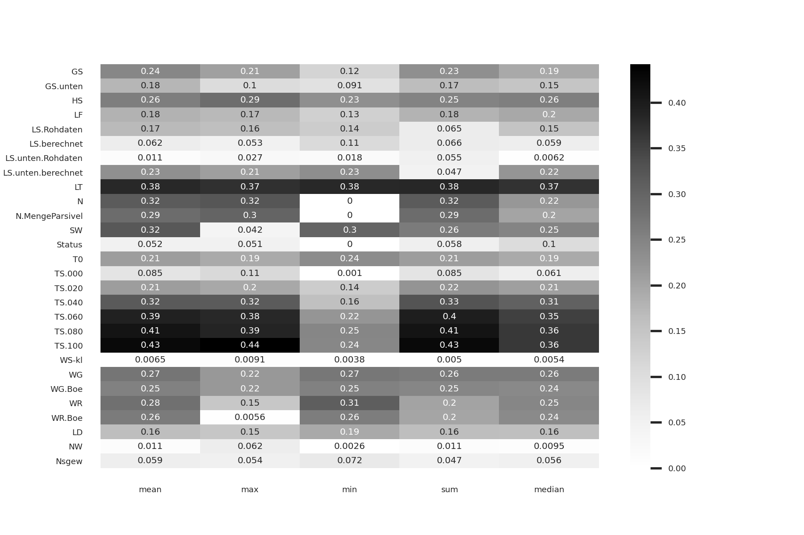
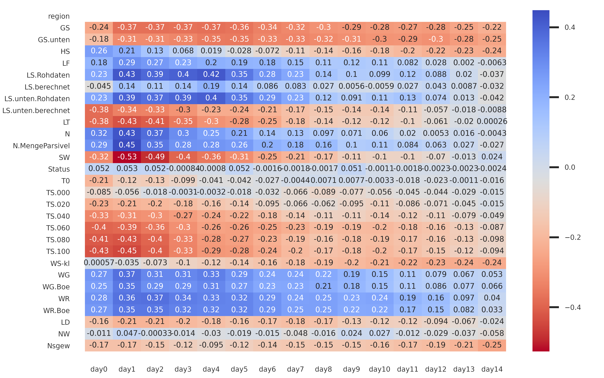

# Predicting avalanche risk in the Bavarian alps

## Project background

Every year, avalanches cause fatalities in mountainious regions. In Bavaria (southern Germany), the "Lawinenwarndienst Bayern" (https://www.lawinenwarndienst-bayern.de/) regularly updates an avalanche danger scale ranging from 1 (low risk) to 5 (extreme risk) to provide information about current risks for six different regions. This score is established through expert considerations based on weather data of the preceding days.

Goal of this project is a) to model the avalanche danger score per region by means of aggregated weather data and b) to identify the most important variables determining avalanche risk.

This figure shows the different steps of this project and some Python packages used.

## How to use this code

The Python code to model the avalanche risk scores can be downloaded from this GitHub repository. 

**Data**
Historical avalanche warning levels can be web-scraped from the Lawinenwarndienst web page by means of the code under `scrape`. In order to reproduce the modeling process, however, historical weather data have to be obtained from Lawinenwarndienst Bayern. These data cannot be shared here without permission.

**EDA**
The eda folder contains `eda_warnings.py` which provides summary statistics and plotting for the historical avalanche warning levels, and ?`eda_weather.py` which does the same thing for historical weather data. The results are also shown below.

**Preprocessing and modeling**
The folder `model` contains `model.py` which contains the code to model avalanche risk scores. Note: Because the modeling process requires tweaking many different parameter combinations, this file should be adapted and executed line by line in an IDE.

## Available data

Historical avalanche danger levels are available on https://www.lawinenwarndienst-bayern.de/res/archiv/lageberichte/. They can be web-scraped by means of the code available under `scrape`.

Historical weather data were requested from Lawinenwarndienst Bayern. This authority collects weather data specifically for understanding avalanche risk at several weather stations throughout the Bavarian alps.

Metrics:
* Snow height (HS)
* Air pressure (LD)
* Air humidity (LF)
* Air temperature (LT)
* Precipitation amount (N)
* Precipitation (boolean) (NW)
* Weight of precipitation (Nsgew)
* Surface temperature (T0)
* Snow temperature at XX cm height (TS.0XX)
* Wind speed (WG) and wind speed of gusts (WG.Boe)
* Wind direction (WR and WR.Boe)
* Longwave radiation (LS)
* Visual range in meters (SW)
* Soil humidity (BF)
* Soil temperature (BT)
* Global radiation (GS)
* Snow pillow water column (WS)
* Ice fraction on snow bands (EAN)
* Water fraction of snow bands (WAN)
* Density of snow bands (RHO)

Available metrics differ from station to station, but often have a significant overlap for basis metrics like amount of precipitation (N), wind speed (WG) or snow height (HS).

This example shows the metrics wind speed (WG), air pressure (LD), air temperature (LT) and snow height (HS) over the course of a month (left) and some years (right). It is clearly visible that some variables follow a seasonal pattern (e.g. snow height, air temperature), while others (e.g. wind speed) are much more noisy.

## Outcome

### EDA

**Avalanche risk scores**

The distribution of warning levels is clearly unbalanced in every year and every region, with warning levels 1 and to being most prominent. Level 3 occurs frequently in some years (e.g. in 2009) but less frequently in others (e.g. 2014). Risk level 4 appears in less than 10 percent in all years. Risk level 5 was never reported in Bavaria.

**Weather data**

Some of the weather variables are closely correlated with each other. Red values indicate negative correlation, blue values indicate positive correlation.

The available weather data shows a significantly higher time resolution (10 minutes), compared to the time resolution of the avalanche risk which is updated only daily. Therefore, the weather-related data had to be aggregated to daily levels. The correlation between differently aggregated weather data (mean, max, min, median and sum) and the target variable were compared; the results show that weather data aggregated through a "mean" function shows the highest correlation with the target variable. Therefore, this aggregation was used for the modeling process.

The warning levels of a day is associated with weather data from preceding days. This figure shows the correlation (values and colors) between predictors (y axis) and the target variable, broken down by time lag (x axis). It is clearly visible that the avalanche warning of a day is associated with weather data of the preceding days, most notable of the two days before ("day1" and "day2" on the x axis).

### Modeling

The modeling was performed for a single region (Allgäu) only, but the process can be repeated for  the other five monitoring regions as well.

A baseline model (Naive Bayes) trained on all predictor variables (exluding those with larger fractions of missing values) yields a training and validation accuracy of 50%.

By means of a **recursive feature elimination**, the most relevant variables can be determined. RFE was executed by means of a Random Forest and a Logistic Regression, and the average of their results was taken.

While Random Forest and Logistic Regression sometimes show disagreement over the importance of a predictor, some variables do nevertheless seem to be more important than others (N, SW, GS, LT, HS, TS etc.) The sometimes contradicting result of the two algorithms might be due to strong correlations between some predictors which could lead to "arbitrary" choices between them through the algorithm.

Due to the large imbalance of the target variable (with higher risk levels being significantly underrepresented), the minority classes were oversamples by means of **SMOTE** (Synthetic minority oversampling technique). This greatly helped in stabiliting the results across the target variable classes.

Even when including many predictor variables, the residuals of the predictions still show some autocorrelation. Including the time-lag of the target variable to the predictors increases the model's performance significantly.

Of several different algorithms tried (Naive Bayes, Logistic Regressions, Support Vector Machines, Random Forest, Neural Network, Gradient Boosting), the Random Forest achieved the best results with a training accuracy of 87% and a validation accuracy of 84%.

The following table summarizes some results of the modeling process (feat = included features, TimeShift = how many days of lag between predictors and target variable, SMOTE = oversampling of minority classes, Autoc = inclusion of the time-lagged target variable as a predictor, Acc = training accuracy, ValAcc = validation accuracy):

| Model | Feat | TimeShift | SMOTE | Autoc | Acc | ValAcc
| ----- | ----- | ----- | ----- | ----- | ----- | ----- | 
| LogReg | all | 1 | no | no | 0.67 | 0.63 |
| LogReg | all | 1-2 | no | no | 0.71 | 0.60 |
| LogReg | rfe | 1-2 | no | no | 0.68 | 0.60 |
| LogReg | rfe | 1-2 | yes | no | 0.75 | 0.72 |
| LogReg | rfe | 1-2 | yes | yes | 0.85 | 0.80 |
| RF | rfe | 1-2 | yes | yes | 0.87 | 0.84 |

## License

MIT License